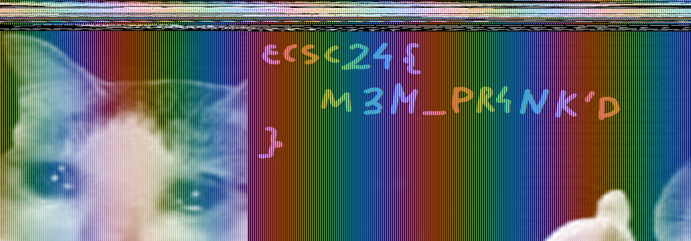

# [forensics - Office Retribution](https://hack.cert.pl/challenge/office-retribution)

Use [volatility3](https://github.com/volatilityfoundation/volatility3) to list processes in the dumped memory:
```
vol -f office-retribution-50868c9be28a0922ab52782e698f8ac4eb520fbf.raw windows.pslist
```
Fromt the output, you can see that paint was running:
```
3904	1332	mspaint.exe	0x8442e030	7	138	1	False	2024-06-10 11:35:54.000000 	N/A	Disabled
```
Dump `mspaint.exe` memory:
```
vol -f office-retribution-50868c9be28a0922ab52782e698f8ac4eb520fbf.raw windows.memmap --pid 3904 --dump
mv pid.3904.dmp dump.data
```
Open `dump.data` in Gimp as RAW data, change offset to `12770703` and width to `1400` to see an image:



### Flag
```
ecsc24{M3M_PR4NK'D}
```