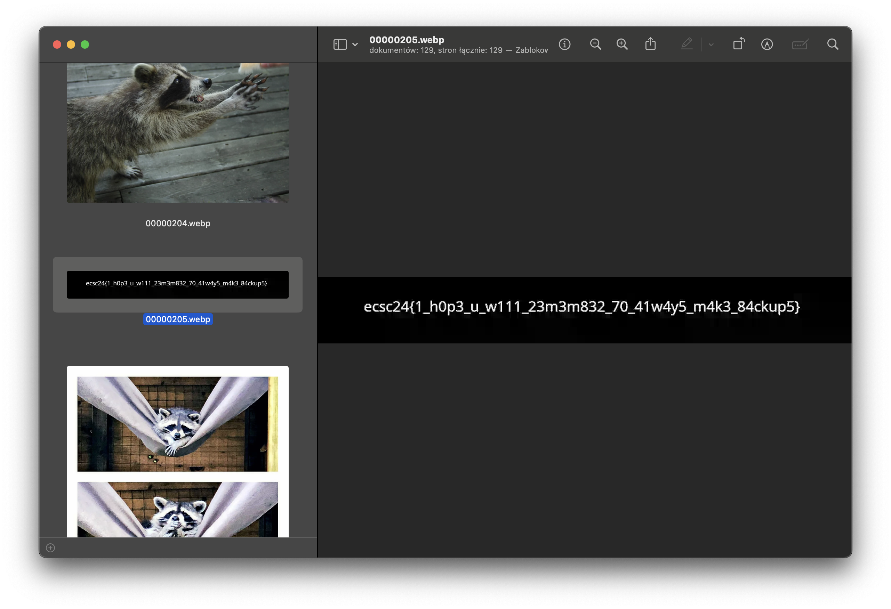

# [forensics - The zettabyte file search](https://hack.cert.pl/challenge/zettabyte)

Using command `strings zettabyte-088dfef4fc0aa071bc88909247568f8b22728358.raw | grep flag` you get the flag file's name:
```
clear_flag
aflags
flag.webp <<---------
flag.webp
flag.webp
H_clear_flag4
dane_clear_flags.P
_inh_flags
```

Recover all `.webp` files by searching for `RIFF` header using [scalpel](https://github.com/sleuthkit/scalpel):
```bash
echo 'webp y 2000000 \x52\x49\x46\x46' > webp.conf
scalpel -c webp.conf -o out zettabyte-088dfef4fc0aa071bc88909247568f8b22728358.raw
open out/webp-0-0/*
```


### Flag
```
ecsc24{1_h0p3_u_w111_23m3m832_70_41w4y5_m4k3_84ckup5}
```