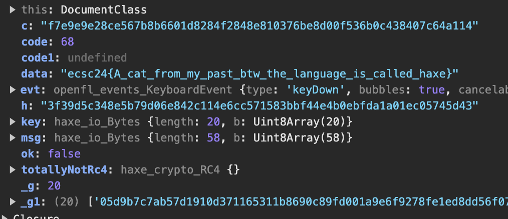

# [re - Magiczna cat](https://hack.cert.pl/challenge/magiczna-cat)

In the `onKeyDown` event listener code (line `3536` of `game.js`), you can see that keyboard keys, other than arrow keys, are used to decrypt the flag. Certain key codes create `Main_entry`, which is used as a key in decryption. You can brute force the correct key codes and obtain the key:
```py
from hashlib import sha256

Main_checks = [
    "05d9b7c7ab57d1910d371165311b8690c89fd001a9e6f9278fe1ed8dd56f0788",
    "1778e423d6d629d89c2f839814378cebdb54d167bb8d43143e7e7052ba390546",
    "1f5998b5f01949b961b0189099f8af47a73da3cce4521fd7d932d3ae518106f1",
    "340575f433c680e201a894e51bc5c6cb16b2d09a26938ff0ac35a6aeed3dd66b",
    "4b9a236f5587b132745a993b2f8736a20ab3bf6aeb1c0dc4c24b794de3cc7e4a",
    "5880d0caa9c6f152151c5f5d935139f34a9f850a9f5c5e81976c3ced48ef5ba0",
    "5c7bb34803e9a28c2b3ff34373ae01d34a9116688e0153f006f59bdc4f21f0c1",
    "687d68de9d92a2a6d4765c2e372ae41fdd42534b285934b35606a1a69aeca453",
    "8de0b3c47f112c59745f717a626932264c422a7563954872e237b223af4ad643",
    "945f07d2c12bf634dfa8edab9a914732e276e975deb24139cca765bcee5b4d4c",
    "966fc9246a0db76e33308466ec84582061b123f1f4c6c1ff8851821472d17a05",
    "a79af54bb80ae8664c68ef9cd02fa4adb814d350eca3da517dd4590ea5b12912",
    "ac21b3d2df2fb1f258358747cc0ab3458bec3b6a96ffda13ee66929ea80f0a46",
    "bb5ebee9fa8db78b93f8f6bd15e8af72ea5678514e13ab62bb468d97b8e76b7e",
    "cb0fecfd6feaef33c38a7c82ce6f662ca13ea357caac699e45a436bf702db8c6",
    "d21e5e50b6510751e1a4631e158ddc4ab53b626a0342c636f2c58dd8536f851c",
    "e652823acb97d1510826d83092f6f059d237af6d28d04d89c0eab3c2397cea82",
    "e9e35bd4379f5ac0064353a2171e8ad4d7923570d4c57807b679a03e954b99cd",
    "f5aeb0b6798a7470cf56920ff59e499d0e5e8d0eda7049b533a97c5f31c93e8b",
    "f7e9e9e28ce567b8b6601d8284f2848e810376be8d00f536b0c438407c64a114"
]


def sha256(data):
    return sha256(data.encode()).hexdigest()

Main_entry = ""

while True:
    for code in range(256):
        ok = False
        g = 0
        while g < len(Main_checks):
            c = Main_checks[g]
            g += 1
            h = sha256(Main_entry + chr(code))
            if h == c:
                Main_entry += chr(code)
                ok = True

        if ok:
            print(Main_entry)
            break
    else:
        break

# output: SPEAKCHONKERANDENTER
```

Then simply create a breakpoint in devtools debugger, modify the code the way it gets to the flag decryption and replace `Main_entry` with the key (`SPEAKCHONKERANDENTER`). It should look like this:
```js
if(false) {
    Main_entry = "";
} else if(true) {
    this.chonker.dead = true;
    this.chonker.text.set_text("What did you just call me?");
    motion_Actuate.tween(this.chonker.sprite,5,{ alpha : 0}).delay(1);
    motion_Actuate.tween(this.chonker.text,5,{ alpha : 0}).delay(1);
    this.chonker.interact();
    var key = haxe_io_Bytes.ofString("SPEAKCHONKERANDENTER");
    var msg = haxe_io_Bytes.ofHex(Main_puma);
    var totallyNotRc4 = new haxe_crypto_RC4();
    totallyNotRc4.init(key);
    var data = totallyNotRc4.encrypt(msg).toString();
    this.flag.text.set_text(data);
}
```

Then step over to the point once the flag is decrypted and read it from the debugger:



### Flag:
```
ecsc24{A_cat_from_my_past_btw_the_language_is_called_haxe}
```